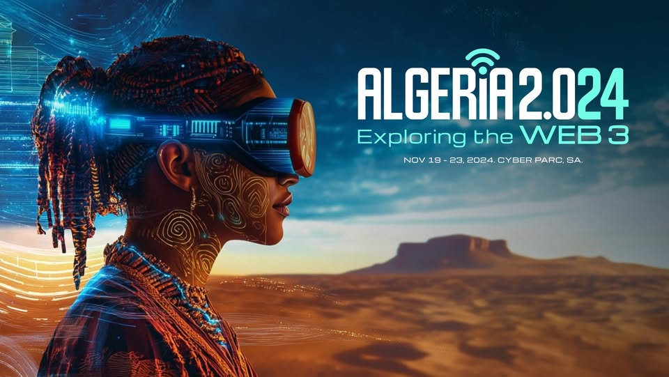

# Advanced React: State Management with Context and Hooks Workshop

Welcome to the **"Advanced React: State Management with Context and Hooks"** workshop project! This repository contains the code for the task management app we'll be building during the **Algeria 2.0** event on **21st November 2024 at 9:00 a.m**. This workshop will dive deep into React's Context API and Hooks to manage global state and create a fully functional task management app.



## 📝 Project Description

The goal of this project is to create a **Task Management Application** using **React**, where users can manage their tasks across different categories (Business, Personal, etc.) while sharing state globally using **Context API** and **React Hooks**.

### 🛠️ Features:

- **Task Categories**: Organize tasks into categories like "Business" and "Personal".
- **Global State Management**: Utilize the Context API to manage tasks globally across components.
- **Task Completion**: Mark tasks as complete or pending.
- **Dynamic Task Management**: Add and remove tasks dynamically with a real-time update of the task list.
- **Custom Hooks**: Improve code reusability and structure using custom hooks.
- **Clean UI**: A user-friendly interface with smooth interaction for task management.

## 🌟 Event Name

This workshop is part of the **Algeria 2.0** event happening on **21st November 2024 at 9:00 a.m**. The event is one of the biggest tech conferences in the region, bringing together developers, tech enthusiasts, and industry professionals.

## 🚀 Getting Started

To run this project on your local machine, follow the instructions below:

### Prerequisites

- [Node.js](https://nodejs.org/en/) (version 18 or higher)
- [npm](https://www.npmjs.com/) or [yarn](https://yarnpkg.com/)
- [Vite](https://vitejs.dev/) (preferred for its fast build)

### Installation

1. install nodejs

2. test if nodejs is installed: (node: v22.11.0) (npm: v10.0.0)

   ```bash
   node -v
   npm -v
   ```

3. Clone this repository:

   ```bash
   git clone https://github.com/mohamed7372/todo-list-algeria-2.0
   ```

4. Install dependencies:

   ```bash
   npm i
   ```

5. Start react app:
   ```bash
   npm run dev
   ```

## 📸 Screenshots

Here are some screenshots of the **Task Management App** UI:

### Home Page:


### Task Management:


## 📚 Workshop Agenda

The workshop will cover the following topics:

1. **Introduction to Context API and Hooks** (10 mins)

   - Review React hooks and introduce the Context API for state sharing.

2. **Project Setup and Component Structure** (5 mins)

   - Create a React app using Vite and plan component hierarchy.

3. **Implementing Global State with Context API** (15 mins)

   - Set up a global state to manage tasks using the Context API and `useReducer`.

4. **Dynamic Task Management** (15 mins)

   - Add and remove tasks dynamically, updating global state.

5. **Optimizing with Custom Hooks** (10 mins)

   - Create custom hooks to organize logic and improve reusability.

6. **Q&A and Wrap-Up** (5 mins)
   - Review key concepts and answer participant questions.

## 👨‍💻 Author

<p style="margin-top: 20px;"></p>


- **BENRABAH Mohamed**: MERN Stack Developer and Workshop Host at **Algeria 2.0**.
- **Portfolio**: [My Portfolio](https://benrabah-mohamed.netlify.app/)
- **LinkedIn**: [My LinkedIn](https://www.linkedin.com/in/mohamed-benrabah-522992191/)
- **GitHub**: [My GitHub](https://github.com/mohamed7372)

## 📅 Event Details

- **Event**: Algeria 2.0
- **Date**: 21st November 2024
- **Time**: 9:00 a.m
- **Location**: Algiers, Algeria

## 🛠️ Built With

- **React** - JavaScript library for building user interfaces
- **Vite** - Next-generation front-end tool for faster builds
- **Context API** - React's solution for managing global state
- **useReducer Hook** - A hook for complex state logic

## 📬 Get in Touch

Feel free to connect with me on any of the platforms above. If you have any questions or want to collaborate, don't hesitate to reach out!

---

Thank you for checking out the project, and I hope you enjoy the workshop! 🎉
